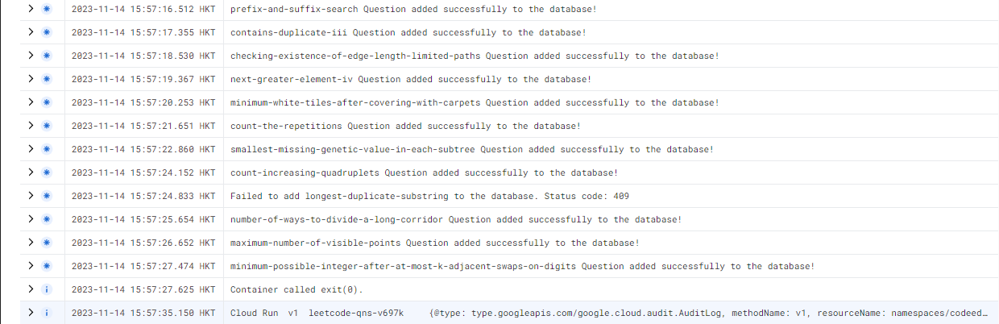

# Assignment 6

## Leetcode question service

A python script that retreives question from leetcode through its internal APIs and GraphQL. It has been containerized into a DockerFile as per assignment requirements.

### Setup

To run locally remove google.cloud logger and use default logger as google auth is required

Remove/Comment the following logger google_logger is intended for logging on GCP

```
logging_client = logging.Client()
log_name = "google_logs"
google_logger = logging_client.logger(log_name)
```

Instead use the python default logger with the following code to view logs

```
logging.basicConfig(filename='output.log', level=logging.INFO, format='%(asctime)s - %(levelname)s - %(message)s')
```

### Running leetcode question service using Docker

Ensure that you are in leetcode-qns-service directory.

```
docker compose up -d
```

### Example of logs on GCP side


